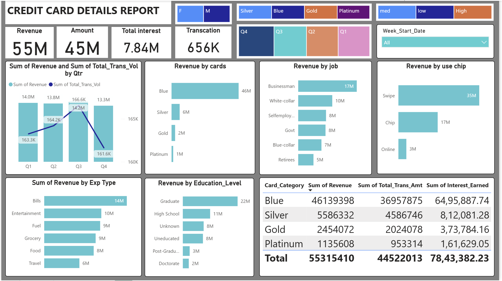

# 💳 Credit Card Customer Analysis & Dashboard

## 📌 Project Overview

This project focuses on analyzing **credit card transaction data** to uncover customer spending behavior, revenue trends, and key business insights.
An interactive dashboard was built to help stakeholders make **data-driven decisions**.

---

## 🎯 Objectives

* Analyze customer spending patterns
* Identify high-value customers
* Understand revenue distribution across categories
* Provide actionable business insights

---

## 🛠️ Tools & Technologies

* Python (Pandas, NumPy)
* SQL
* Power BI
* Excel

---

## 📊 Dashboard Preview



---

## 📈 Key Insights

* 💰 Total Revenue: **55M+**
* 💳 Total Transactions: **656K+**
* 📊 Blue card category contributes the highest revenue (~46M)
* 👨‍💼 Businessmen generate the highest income segment (~17M)
* 💡 Swipe transactions dominate usage (~35M)
* 🧾 Bills and Entertainment are top spending categories

---

## 📌 Features of Dashboard

* Revenue analysis by **Quarter (Q1–Q4)**
* Card category comparison (Blue, Silver, Gold, Platinum)
* Customer segmentation by **Job & Education**
* Expense type analysis (Bills, Fuel, Grocery, etc.)
* Transaction mode analysis (Swipe, Chip, Online)
* Interactive filters (Quarter, Card Type, Gender)

---

## 🔍 Data Analysis Process

1. Data Cleaning & Preprocessing
2. Exploratory Data Analysis (EDA)
3. Data Transformation using Python & SQL
4. Dashboard Creation using Power BI

---

## 📁 Project Structure

```
📂 Credit-Card-Analysis
 ┣ 📊 dashboard.pbix
 ┣ 📄 dataset.csv
 ┣ 📄 README.md
 ┗ 🖼 dashboard.png
```

---

## 🚀 How to Use

1. Download the `.pbix` file
2. Open in Power BI Desktop
3. Interact with filters and visuals

---

## 📌 Future Improvements

* Add machine learning for customer segmentation
* Predict customer churn
* Real-time data integration

---

## 👤 Author

**Your Name**
📍 Mumbai, India
🔗 LinkedIn: https://www.linkedin.com/in/atharv-sahare-6a4b99314

---

## ⭐ If you found this useful

Give this repo a ⭐ and connect with me!

